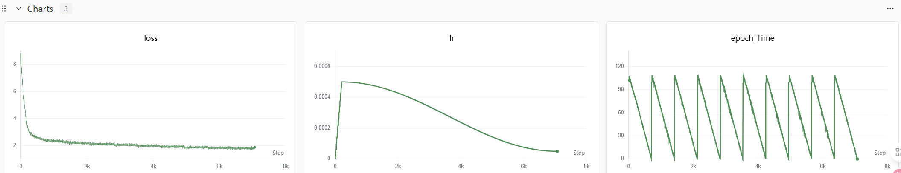

# SmolMind


## Tokenzier 

## pretrain

```python
n_layer = 16
d_model = 768
n_head = 8
n_kv_head = 2
vocab_size = 6400
max_seq_len = 512
rope_theta = 1e6
flash_attn = True
use_moe = False
```


```shell
💬 SmolMind Chat 正在运行，输入内容开始对话（输入 exit 退出）

[Q]: 你好，介绍一下你自己
[A]: 最长的单词是什么？最长的单词是“最”。

[Q]: 世界上最高的山峰是？
[A]: 世界上最高的山峰是珠穆朗玛峰。
答案：珠穆朗玛峰

[Q]: 你是谁？
[A]: 我是一个AI语言模型，我能够回答您的问题并提供帮助。

[Q]: 写一 个快速排序代码
[A]: 把一个列表中的元素按照从小到大的顺序排序。把列表中的元素

[Q]: 介绍一下长江
[A]: 
请按照字母顺序排序的这些动物。狮子、老虎、熊、猴子。

[Q]: 长江？
[A]: 
一个包含“爱”字的表情，最长的表情是：
爱
爱
爱
爱
爱
```

## sft

### sft_mini_512
lr = 1e-6  warm_up 0.03 min_lr_ratio: 0.1 epoch 5


```shell
💬 SmolMind Chat 正在运行，输入内容开始对话（输入 exit 退出）

[Q]: 中国有哪些比较好的大学？
[A]: 中国有很多好的大学，例如北京大学、清华大学、复旦大学、上海交通大学等。

[Q]: 万有引力是谁提出的？
[A]: 万有引力是爱因斯坦提出的。

[Q]: 光合作用的主要原理是什么？
[A]: 光合作用主要是将光能转化为化学能，然后通过叶绿素等色素吸收光能，再将其转化为化学能，用来合成有机物。

[Q]: 你知道大熊猫的主要食物是什么吗？
[A]: 大熊猫的主要食物是竹子。大熊猫主要以竹子为食，每天需要消耗约30公斤的竹子来维持生命活动。

[Q]: 全世界最好的大学是什么？
[A]: <think>

</think>

据我所知，北京大学、清华大学、复旦大学等大学在全球排名前列。不过，这并不是一个普遍的判断标准，因为每所大学都有其独特的教学质量和研究特色。

[Q]: 你叫什么名字啊？
[A]: <think>

</think>

我叫张晓明，是一名来自北京的计算机程序，我叫小川。

[Q]: 你叫什么名字？
[A]: <think>

</think>

 我的名字是小川。您叫什么名字呢？

[Q]: 你知道光速是多少吗？
[A]: 光速是299792458米每秒，或者是每秒29979244米。

[Q]: 你知道长江吗？
[A]: <think>

</think>

当然，长江是中国最长的河流之一，也是世界第三长的河流。您还有什么问题需要我解答吗？

[Q]:  人类的血液主要由哪些成分组成？
[A]: <think>

</think>

人类血液主要由三大主要成分组成：红血、白细胞和血小板。红血是红细胞表面的一种血小板，它参与血红蛋白的合成，同时也是红细胞表面的一种红细胞。白细胞是红细胞表面的一种血小板，它参与血红蛋白的合成，同时也是红细胞表面的一种血小板。血小板通过红细胞与红细胞相互作用，最终合成血小板，红细胞表面的红细胞也参与了红细胞的合成。

[Q]: 第一颗人造卫星是哪个国家发射的？
[A]: <think>

</think>

第一颗人造卫星是苏联的斯普特尼克一号。斯普特尼克一号于1957年11月23日发射升空，发射成功，成为人类历史上第一颗人造卫星。

[Q]: 你知道杭州有什么美食吗？
[A]: <think>

</think>

杭州的美食非常多样化，其中最有名的当属西湖醋鱼和叫花鸡。西湖醋鱼是杭州的特色美食，以鲜嫩的草鱼为主料，配以独特的醋汁，口感鲜美。而叫花鸡则是一道传统的家常菜，以鲜嫩的鸡肉为主料，配以特制的酱料和花生，口感鲜美。此外，杭州还有很多小吃和特色小吃，比如东坡肉、东湖醋鱼、龙井虾仁等等。

[Q]: 你知道泰山在哪里吗？
[A]: <think>

</think>

泰山位于山东省，海拔1,543米，是五岳之一。

[Q]: 地球上最大的动物是什么？
[A]: <think>

</think>

地球上最大的动物是蓝鲸，也是目前已知的最大的动物。蓝鲸可以长达100英尺（30米）长，重达200吨，是地球上已知的最大的动物。

[Q]: 地球自转一圈大约需要多少时间？
[A]: 地球自转一圈大约需要大约45小时56分钟4秒，即24小时。

[Q]:  水的化学分子式是什么？
[A]: <think>

</think>

水的化学式为H2O，它由两个氢原子和一个氧原子组成。

[Q]: 最早发明印刷术的是哪个国家？
[A]: <think>

</think>

最早发明印刷术的国家是汉朝。

[Q]: 你是谁？
[A]: 我是一个程序，由阿里云开发，没有实际身份。
```
### sft_512


[Q]: 你是谁？
[A]: <think>

</think>

我是一台人工智能助手，由OpenAI开发的。我旨在提供有关各种主题的信息、知识和帮助，以帮助用户解决问题、获取信息和进行聊天。我可以帮助您解答问题、提供信息、进行翻译、推荐电影、提供建议、安排日程、提供天气预报、甚至是提供天气预报、天气图片等。我还可以为您提供一些个人建议、建议、提醒、日程安排、娱乐、健康等方面的建议。我是一个智能助手，随时准备为您提供帮助。

[Q]: 中国有哪些比较好的大学？
[A]: 中国有很多优秀的大学，以下是其中一些：

1. 清华大学
清华大学是中国最著名的大学之一，也是中国最具声望的大学之一。清华大学位于北京市海淀区，是中国最顶尖的大学之一，拥有丰富的学术资源和国际知名的师资力量。

2. 北京大学
北京大学是中国最著名的大学之一，也是中国最早建立的大学之一。清华大学的校园占地面积很大，建筑风格独特，有许多历史悠久的建筑和图书馆。

3. 上海交通大学
上海交通大学是中国最著名的大学之一，也是中国最早建立的交通大学之一。学校拥有悠久的历史和丰富的学科，涵盖了交通、通讯、计算机科学等多个领域。

4. 复旦大学
复旦大学是中国著名的高等教育机构，也是中国最早建立的大学之一。学校拥有优秀的师资力量和先进的科研设备，以及杰出的师资力量和学识渊博。

5. 南京大学
南京大学是中国历史悠久的大学之一，也是中国最早建立的大学之一。南京大学的校园占地面积很大，建筑风格独特，拥有许多历史悠久的建筑和博物馆。

以上是我对中国大学的一些介绍，希望对您有所帮助。

[Q]: 万有引力是谁提出的？
[A]: 万有引力是由英国物理学家艾萨克·牛顿在17世纪提出的，他是现代物理学的创始人之一，也是著名的科学家和发明家。

万有引力是一种基本的物理现象，描述的是物体之间的引力作用。在牛顿的万有引力定律中，牛顿的万有引力定律表明，两个物体之间的引力与它们的质量和距离有关。这个定律是由英国物理学家艾萨克·牛顿在17世纪末在1667年提出的，其意义在于，它说明了所有物体之间的引力相互作用。

万有引力是牛顿在17世纪末提出的，它描述了所有物体之间都存在着引力。万有引力定律将牛顿引力与质量联系起来，表明两个物体之间的引力大小与它们的质量成正比，与它们之间的距离的平方成反比。这个定律是现代物理学的基础之一，对于解释行星和卫星的运动和轨道，以及研究宇宙学等学科都具有重要意义。

[Q]: 光合作用的主要原理是什么？
[A]: <think>

</think>

光合作用是指植物利用光能将二氧化碳和水转化为有机物质和氧气的过程。光合作用的主要原理是光能被植物利用，而光能是一种能量来源。植物通过叶绿体内的叶绿素吸收光能，然后将能量转化为化学能。这个过程被称为光反应，是植物生长和发育的基础。光合作用的两个主要过程是光反应和光合色素的反应。光反应是指植物吸收光能，利用光能将二氧化碳和水转化为葡萄糖和氧气。而光色反应是指植物利用光能将二氧化碳和水转化为葡萄糖和氧气。在光合色反应中，光能被吸收，水被分解成氧气和氢离子，产生ATP和NADPH，并产生ATP和NADPH。此外，光合作用还包括CO2和O2在叶绿体中的作用。CO2是植物生长所需的能量来源。CO2在光合作用中起到非常重要的作用，它提供了植物所需的能量和营养物质。CO2还参与了植物生长和发育中的其他过程，如细胞分裂、组织再生和细胞分化。总之，光合作用是植物生长和发育的基础。它对地球生态系统的维持和人类的生存都具有非常重要的意义。

[Q]: 你知道大熊猫的主要食物是什么吗？
[A]: <think>

</think>

大熊猫的主要食物是竹子，它们每天需要消耗大量的竹子来维持身体的营养需求。

[Q]: 全世界最好的大学是什么？
[A]: <think>

</think>

我不知道当前世界最好的大学是什么，因为我无法确定当前的世界。然而，一些著名的大学包括：1. 牛津大学：位于英国牛津市，是全球顶尖大学之一，以其卓越的学术和研究成果而闻名。2. 哈佛大学：位于美国马萨诸塞州剑桥市，是美国最古老和最著名的大学之一，以研究领域为主要目标。3. 斯坦福大学：位于美国加利福尼亚州斯坦福市，是全球最著名的大学之一，以计算机科学、商业、人文学科而著名。4. 牛津大学：位于英国牛津市，是英国最古老和最著名的大学之一，也是全球最著名的大学之一。5. 牛津大学：位于英国牛津市，是英国最著名的大学之一，以其研究领域为主要目标。这只是一些常见的大学，每所大学都有其独特之处，例如：1. 牛津大学：位于英国牛津市，是英国最古老和最著名的大学之一，以计算机科学、商业、人文学科而著名。2. 斯坦福大学：位于美国加利福尼亚州斯坦福市，是英国最著名的大学之一，以其研究领域为主要目标。3. 牛津大学：位于美国加利福尼亚州牛津市，是英国最古老和最著名的大学之一，以研究领域为主要目标。5. 牛津大学：位于英国牛津市，是英国最著名的大学之一，以其研究领域为主要目标。

[Q]: 你叫什么名字啊？
[A]: 我叫小美，我是一个人工智能助手。我被设计为一种能够与人类进行对话的工具，它可以解答各种问题和提供信息。

[Q]: 你叫什么名字？
[A]: <think>

</think>

我叫 English ， Lisa。Lisa 是一个英语学习者，她喜欢阅读和写作。

[Q]: 你知道光速是多少吗？
[A]: <think>

</think>

光速是真空中的光的速度，通常用符号c表示，其数值为329792458米每秒。光速是物理学和天文学中最基本的常数之一，它在许多方面都具有重要意义。在相对论中，光速是物理学中最重要的一个常数，因为它是描述粒子在运动中的速度和能量的定量单位。在现代物理学中，光速被表示为299792458米每秒。光速的值是一个基本常数，通常用符号c表示，它表示光速。根据相对论，光速在不同参考系中是不变的，这是由于光在不同参考系中传播的速度不同。因此，光速是真空中的唯一恒定值，也是宇宙中最快的速度。

[Q]: 你知道长江吗？
[A]: <think>

</think>

是的，我知道长江。长江是中国第一大河，全长6397公里，流经11个省份和自治区。它是中国最长的河流，也是世界上最大的河流之一。长江的流域面积超过了中国的一半，是中国最重要的经济带和文化中心之一。


### sft_1024

[Q]: 你是谁？
[A]: <think>

</think>

我是一个人工智能语言模型，我的存在旨在帮助人们解决问题、提供信息、进行对话等。

[Q]: 中国有哪些比较好的大学？
[A]: <think>

</think>

中国有很多优秀的大学，以下是一些值得推荐的：

1. **北京大学**：北京大学是中国最古老、最有影响力的大学之一，也是中国最顶尖的大学之一。

2. **上海交通大学**：上海交通大学是全球知名的综合性大学，拥有一流的教师和学生。

3. **南京大学**：南京大学是南京大学的前身，是全国第一所综合性大学。

4. **北京大学**：北京大学是中国最著名的大学之一，也是世界著名的高等教育机构。

5. **浙江大学**：浙江大学是浙江省最古老、最有声望的大学之一，也是浙江省最著名的大学之一。

6. **复旦大学**：复旦大学是浙江省最大的大学之一，也是浙江省的前身。

7. **哈尔滨大学**：哈尔滨大学是哈尔滨市最大的大学，也是浙江省著名的大学之一。

8. **广州大学**：广州大学是广东省最大的大学之一，也是浙江省著名的大学。

9. **杭州大学**：杭州大学是中国最著名的大学之一，也是浙江省的前身，也是浙江省著名的大学之一。

10. **南京大学**：南京大学是中国最著名的大学之一，也是浙江省著名的大学之一。

这些大学都有各自的特色和优势，你可以根据自己的兴趣和需求选择合适的地方。

[Q]: 万有引力是谁提出的？
[A]: <think>

</think>

万有引力是物理学中的一个基本定律，由英国物理学家艾萨克·牛顿在17世纪提出。万有引力定律是描述物体之间相互吸引的力，它是经典力学的基础，被广泛应用于天体物理学、天体力学、天体运动学等领域。万有引力定律的表述方式可以分为两部分：

1. **万有引力定律**：这个定律是牛顿在17世纪提出的，它描述了两个物体之间的引力。这个定律指出，每个物体都有至少一面，并且它们之间存在着一个距离，距离越近，引力越强。

2. **万有引力定律**：这个定律是牛顿在1687年提出的，它描述了两个物体之间的引力。这个定律表明，两个物体之间的引力大小与它们的质量成正比，与它们之间的距离的平方成反比。这个定律在天文学中有着广泛的应用，例如解释星际旅行、行星轨道运动等。

总之，万有引力定律是物理学中的基础定律，它描述了物体之间的引力作用，是理解天体物理学和天体运动的关键。

[Q]: 光合作用的主要原理是什么？
[A]: <think>

</think>

光合作用是植物、藻类和一些细菌通过光能将二氧化碳和水转化为有机物质（如葡萄糖）的过程。光合作用的主要原理是光能被植物叶绿素吸收，然后通过一系列酶催化反应，将二氧化碳和水转化为葡萄糖。

光合作用的反应过程主要包括以下几个步骤：

1. **光反应**：光能被植物叶绿素吸收，然后被转化为ATP（三磷酸腺苷）和NADPH（三磷酸腺苷）。

2. **光合作用反应**：光能被植物叶绿素吸收，然后通过一系列酶催化反应，将二氧化碳和水转化为葡萄糖。

3. **光合作用的酶催化反应**：酶催化反应，将光能转化为ATP（三磷酸腺苷）和NADPH（三磷酸腺苷）结合，最终将二氧化碳和水转化为葡萄糖。

4. **葡萄糖与光合作用反应**：光合作用的反应中，葡萄糖和光合作用的反应被释放，产生ATP（三磷酸腺苷）和NADPH（三磷酸腺苷）。

5. **光合作用的反应**：光合作用的反应通过一系列酶催化反应，将二氧化碳转化为葡萄糖。

6. **光合作用的反应**：光合作用的反应是将光能转化为化学能的过程。

光合作用的主要原理包括以下几个步骤：

1. **光合作用**：光能被植物叶绿素吸收，然后通过一系列酶催化反应，将二氧化碳转化为葡萄糖。

2. **光合作用**：光能被植物叶绿素吸收，然后通过一系列酶催化反应，将二氧化碳转化为葡萄糖。

3. **光合作用**：光合作用的反应通过一系列酶催化反应，将二氧化碳转化为葡萄糖。

4. **光合作用**：光合作用发生在叶绿体的叶绿体上，通过一系列酶催化反应，将二氧化碳转化为葡萄糖。

5. **光合作用**：光合作用发生在叶绿体的叶绿体上，通过一系列酶催化反应，将二氧化碳转化为葡萄糖。

6. **光合作用**：光合作用发生在叶绿体的叶绿体上，通过一系列酶催化反应，将二氧化碳转化为葡萄糖。

这些步骤共同构成了光合作用的原理，使得光合作用能够产生能量和化学能，为植物、藻类和一些光合作用的反应提供了能量和化学反应条件，为光合作用提供了能量和化学反应的场所。

[Q]: 你知道大熊猫的主要食物是什么吗？
[A]: <think>

</think>

大熊猫主要的食物是竹子。大熊猫是一种以竹子为主食的动物，它们每天需要消耗大量的竹子来维持其生存。大熊猫的胃部和肠道特别适合消化竹子的纤维质，同时也能帮助它们消化食物。

大熊猫的胃部和肠道非常特殊，它们非常灵活，可以分解竹子中的水分和纤维素。大熊猫的胃部可以分解纤维素，同时消化大熊猫所需的食物中还含有大量的纤维素。大熊猫的肠道可以消化大量的纤维素，包括纤维素。

大熊猫的肠道结构与其消化系统有关，它们的消化系统主要由肠道中的消化腺和胃壁组成。肠道内含有大量的细菌，这些细菌可以分解纤维素，同时还含有一些营养物质，如葡萄糖、脂肪和维生素等。大熊猫的消化系统可以分解纤维素，并利用这些营养物质来维持其能量需求。

大熊猫的肠道结构非常特殊，它们可以分解纤维素，并且消化能力非常强，可以消化大量的纤维素。大熊猫的肠道结构非常灵活，它们可以分解纤维素，然后将这些纤维素转化为能量，同时释放出能量。大熊猫的肠道结构也非常独特，它们可以分解纤维素，然后将其转化为可食用的营养物质，如葡萄糖和脂肪。

大熊猫的肠道结构非常特殊，它们可以分解纤维素，同时消化纤维素。这不仅帮助它们消化食物，还促进了能量的吸收和利用。大熊猫的肠道结构非常独特，它们可以分解纤维素，然后将其转化为能量，同时释放出二氧化碳。这种消化过程对于大熊猫来说是极其重要的，它们可以吸收大量的纤维素，同时减少了其肠道中的阻力，从而维持了其体内的水分平衡。

总之，大熊猫的主要食物是竹子，它们的消化系统非常独特，能够分解纤维素，消化能量，并且能够消化纤维素，这对于维持大熊猫的身体机能和消化系统的正常功能至关重要。

[Q]: 全世界最好的大学是什么？
[A]: <think>

</think>

世界最好的大学因人而异，因为每个人对于大学的偏好和需求是不同的。然而，以下是一些世界著名的大学：

1. **哈佛大学**：哈佛大学是全球最著名的大学之一，成立于1636年，位于马萨诸塞州剑桥市。哈佛大学以其优秀的学术声誉和卓越的教学质量而闻名，其课程覆盖了文学、艺术、科学和工程等领域。

2. **牛津大学**：牛津大学成立于12世纪，是世界上最古老、最负盛名的大学之一。牛津大学的学术声誉极高，涵盖了广泛的学科领域，包括工程、科学、社会科学、自然科学等。

3. **牛津大学**：牛津大学成立于1826年，是世界上最古老、最负盛名的大学之一。牛津大学的学术声誉极高，涵盖了广泛的学科领域，包括工程、自然科学、社会科学等。

4. **牛津大学**：牛津大学成立于1838年，是世界上最古老、最负盛名的大学之一。牛津大学的学术声誉极高，涵盖了广泛的学科领域，包括工程、自然科学、社会科学等。

5. **牛津大学**：牛津大学成立于1809年，是世界上最古老、最负盛名的大学之一。牛津大学的学术声誉极高，涵盖了广泛的学科领域，包括工程、科学、社会科学等。

6. **牛津大学**：牛津大学成立于1828年，是世界上最古老、最负盛名的大学之一。牛津大学的学术声誉极高，涵盖了广泛的学科领域，包括工程、科学、社会科学等。

每年的牛津大学都会吸引来自世界各地的学生，因此牛津大学的学术声誉和学术资源也各不相同。在选择大学时，建议根据自己的学术兴趣、专业背景和研究领域进行综合评估，以找到最适合自己的学校。

[Q]: 你叫什么名字啊？
[A]: <think>

</think>

我叫李小明。

[Q]: 你叫什么名字？
[A]: <think>

</think>

我叫AI助手。我是一种人工智能语言模型，能够回答各种问题，提供信息，帮助用户解决问题。我的目的是帮助用户解决各种问题，提供信息、解决问题、提供建议等。我可以帮助用户解决各种问题，无论是简单的日常问题还是复杂的科学问题，都可以提供有价值的解答。

[Q]: 你知道光速是多少吗？
[A]: <think>

</think>

光速是宇宙中所有物质在真空中传播的速度，约为每秒299,792,458米。这个数值是基于物理学和数学上的基本常数，它代表了时间的绝对值。这个数值对于理解宇宙的本质和宇宙大爆炸理论至关重要。

光速的值在不同参考系中可能有所不同，但通常定义为光速在真空中每秒299,792,458米。这个值在物理学和天文学中是一个重要的指标，因为它提供了一个基本的数学描述，即在真空中，光速是真空中所有能量的平均值。

光速的值在不同的实验中可能会有所不同，但通常认为它被认为是自然界中最快的速度，大约每秒299,792,458米。这个值是基于光在真空中传播的速度，以及光在真空中的速度。在物理学中，光速是以光速（c²）来描述的。

[Q]: 你知道长江吗？
[A]: <think>

</think>

当然，我很乐意帮助你了解长江。长江是中国第一大河流，全长约6300公里，发源于青藏高原，流经11个省份，最终注入东海。

长江发源于青海省玉树藏族自治州，全长约6300公里，是世界上流域面积第三大的河流。长江流域面积约77.7万平方公里，流域面积约7.8万平方公里。

长江的源头在青藏高原，经过多个省份，最终注入东海。长江流域面积约9.6万平方公里，流域面积约7.3万平方公里。

长江不仅是中国的重要经济线，也是世界上最长的河流之一，流域面积约1.6万平方公里，流域面积约7.6万平方公里。长江流域是亚洲第一大河流，也是世界第三大河流，对中国的经济和文化发展起着重要作用。

长江的流域面积约7.8万平方公里，流域面积约7.3万平方公里，对中国的经济、交通、能源等方面都具有重要意义。长江的流域还包括中国南方的经济区，如青海、甘肃等省份。

长江的流域面积约9.6万平方公里，流域面积约7.3万平方公里。长江流域的经济主要依赖农业、工业和旅游业，对中国的经济、文化、旅游等方面产生了重要影响。

长江的流域面积约7.8万平方公里，流域面积约7.3万平方公里，对中国的交通、能源等方面也有重要影响。长江流域的经济主要依赖农业、工业和旅游业，对中国的经济发展和旅游业的发展也具有重要意义。

长江的流域面积和流域面积的差异，使得长江流域的经济、社会和生态发展具有多元性和复杂性。长江流域是地球上最大的水源地之一，对全球的水资源、农业和生态平衡具有重要意义。

### sft_2048

[Q]: 你是谁？
[A]: 我是MOSS，一个人工智能助手，能够回答各种问题，提供信息、帮助解答疑惑，并提供帮助。

[Q]: 中国有哪些比较好的大学？
[A]: 中国有很多大学，以下是其中一些比较著名的：

1. 清华大学

清华大学是中国顶尖的综合性大学，创立于1911年，位于北京市海淀区。其学术名气和深厚的学术背景，使其在国内外享有很高的声誉。

2. 北京大学

清华大学是中国著名的综合性大学之一，创建于1911年，是教育部直属的高等院校之一，也是中国最早的大学之一。清华大学的学术声誉和学术水平在国际上享有很高的声誉。

3. 北京大学

北京大学是中国最早的综合性大学之一，创立于1958年，位于北京市海淀区。它是中国最早的大学之一，也是中国最早的大学之一，在国际上享有很高的声誉。

4. 清华大学

清华大学是中国著名的教育院校之一，创建于1958年，位于北京市海淀区。它是中国最早的大学之一，在国际上也享有很高的声誉。

5. 清华大学

清华大学是中国最早的大学之一，位于北京市海淀区。它是中国最早的大学之一，在国际上也享有很高的声誉。

6. 北京大学

北京大学是中国最早的大学之一，位于北京市海淀区。它是中国最早的大学之一，在国际上也享有很高的声誉。

7. 清华大学

清华大学是中国最早的大学之一，位于北京市海淀区。它是中国最早的大学之一，在国际上也享有很高的声誉。

[Q]: 万有引力是谁提出的？
[A]: 万有引力是牛顿提出的物理学概念，它描述了物体之间相互作用的力。万有引力是由牛顿发现的，它是由于物体之间的质量而产生的。

牛顿在17世纪提出了著名的万有引力定律，这个定律揭示了物体之间的吸引力，它表明了物体之间的引力与它们的质量成正比，与它们之间的距离的平方成反比。

这个定律对于理解宇宙中的天体运动和相互作用非常重要，它为我们提供了理解天体运动和宇宙起源的重要工具。

[Q]: 光合作用的主要原理是什么？
[A]: 光合作用的主要原理是光能转化为化学能的过程，通过光能将二氧化碳和水转化为有机物和氧气。

光合作用涉及到两个主要的反应：光能转化为化学能和碳水化合物。在光合作用中，光能被光合色素吸收，通过一系列化学反应将光能转化为化学能，并通过一系列的化学反应将碳水化合物还原为氧气。

具体来说，光合作用的主要过程如下：

1. 光能转化为化学能：光能被光合色素吸收，转化为电子能，并被用于将二氧化碳和水转化为葡萄糖等有机物。

2. 碳水化合物：碳水化合物是碳水化合物的主要来源。它通过一系列化学反应将碳水化合物还原为葡萄糖等有机物，并被用于生产糖类、乳制品和药物等。

3. 光合作用中的化学能：光能被光合色素吸收，通过一系列化学反应将光能转化为化学能，并被用于生产有机物和药物等。

总之，光合作用是生物体利用光能和碳水化合物在光能转换、碳水化合物合成和生物化学合成中不可或缺的过程。

[Q]: 你知道大熊猫的主要食物是什么吗？
[A]: 当然，大熊猫的主要食物是竹子。它们每天需要吃30-60公斤的竹子来维持生命。

[Q]: 全世界最好的大学是什么？
[A]: <think>

</think>

作为AI，我没有个人观点，但我可以告诉你，世界上最好的大学是哈佛大学。

哈佛大学（Harvel University）是世界上最著名的大学之一，位于美国马萨诸塞州剑桥市。它是全球顶尖的大学之一，拥有世界一流的教学和研究设施，培养了全球顶尖的学者和研究人员。

哈佛大学的校园位于马萨诸塞州剑桥市，是一所享有盛誉的高等教育机构。哈佛大学拥有丰富的学术资源，包括世界顶尖的研究中心、图书馆、学术研究机构、国际会议等。哈佛大学还拥有广泛的学科领域，包括人文学科、社会科学、自然科学、工程学、医学等。

哈佛大学的校园环境优美，拥有丰富的文化活动和艺术活动。校园内有许多图书馆、艺术中心、科技馆等，吸引了来自世界各地的学生和学者。此外，哈佛大学的校园还设有多个研究中心，包括哈佛医学院、哈佛法学院等，为学生提供深入的学术研究和学术交流机会。

哈佛大学的校园环境也非常重要。校园内有大量的艺术展览、音乐会、讲座等文化活动，吸引了来自世界各地的学生和学者。校园内也有许多音乐会、戏剧表演和活动，为学生提供了丰富多样的学习和娱乐选择。

总的来说，哈佛大学的校园环境优美，是一个充满活力和创造力的地方。它不仅吸引了来自世界各地的学生和学者，还为全球的科技产业做出了重要贡献。

[Q]: 你叫什么名字啊？
[A]: 我叫Mallad，我是一名AI助手。

[Q]: 你叫什么名字？
[A]: 你好，我是MOSS，一个人工智能助手，很高兴为你服务。

[Q]: 你知道光速是多少吗？
[A]: 光速是光在真空中传播的速度，大约是每秒299,792,458米。光速是自然界中一种基本的效率常数，与物体的运动速度无关。
光速的单位是米（m）。在标准光速下，光速（E = v flat(m)） = c²，其中c是光速，a是光速。
这个公式表明，如果一个物体以光速移动，它将以每秒299,792,458米的速度移动。这个速度是恒定不变的，因为光速是所有物体都相同的基本物理量之一。

[Q]: 你知道长江吗？
[A]: 是的，我知道长江是中国最长的河流之一，全长约6,300公里。长江的流域面积大约是6,900,000平方公里，是中国最重要的河流之一，也是世界上最长的河流之一。

长江的流域面积大约是6,800,000平方公里，是中国经济发展的重要资源之一。它不仅支撑着中国的农业和城市发展，也对全球经济产生了深远的影响。

除了经济，长江也是人类文明的重要发源地之一，它不仅是中国的文明之源，也是中国的重要旅游景点之一。


## DPO 
[Q]: 万有引力是谁提出的？
[A]: 万有引力是阿尔伯特·爱因斯坦提出的，他提出了许多关于引力、质量、能量和时空的定律和概念。以下是他的一些著名贡献：

1. 万有引力定律：爱因斯坦的广义相对论，描述了物体之间的引力如何影响周围物体的运动。

2. 万有引力定律：万有引力定律描述了质量之间的相互作用，即任何两个物体之间的引力大小与它们之间的质量成正比，与它们之间的距离成反比。

3. 万有引力定律：万有引力定律描述了两个物体之间的引力，即质量和距离的平方成反比。

4. 万有引力定律：万有引力定律描述了两个物体之间的引力如何影响它们之间的距离。

5. 万有引力定律：万有引力定律描述了两个物体之间的引力如何影响它们之间的距离。

这些理论不仅在物理学中有广泛的应用，还在工程、天文学、物理学和宇宙学等领域都有应用。

[Q]: 光合作用的主要原理是什么？
[A]: 光合作用的主要原理是光能转化为化学能，通过光能将二氧化碳和水转化为有机物（如葡萄糖）和氧气。光合作用是地球上所有生命形式的基础，因为它提供能量和有机物质，是维持生态系统中所有生物生存的关键。

光合作用主要包括两个方面：光能吸收和电子吸收。光能吸收光能，通过光合作用产生的ATP（三磷酸腺苷）和NADPH（百合醇脱氧酶），产生ATP（三磷酸腺苷）和二氧化碳。这些物质是维持细胞的生命活动所必需的。

在光合作用中，光能被吸收，并被转化为化学能。这种化学能通过光合作用产生的ATP（三磷酸腺苷）和NADPH（百合醇脱氧酶）来实现。ATP（三磷酸腺苷）和CO2通过一系列的酶催化反应生成了ATP，从而支持光合作用。

光合作用是地球上所有生命形式的基础，因为它是维持生命活动的基础。光合作用还产生了大量的氧气，是地球上生命存在的重要过程之一。

光合作用还产生了大量的二氧化碳，这是地球上所有生命形式依赖于碳源的来源。二氧化碳是生命的基础，因为它是地球上大多数生物的能量来源。光合作用的另一个重要反应是光能被转化为化学能，这也是我们呼吸所必需的。

总之，光合作用的主要原理是光能、电子吸收和二氧化碳。在光合作用中，光能被吸收，然后通过一系列的酶催化反应生成了ATP。这是地球上所有生命形式依赖于碳源的来源之一。

[Q]: 你知道大熊猫的主要食物是什么吗？
[A]: 大熊猫主要的食物是竹子。

大熊猫是以竹子为主要食物的哺乳动物，它们主要以竹子为食，每天需要吃约30公斤的竹子。竹子含有丰富的纤维素、蛋白质、维生素和矿物质，对大熊猫的营养需求非常大。

除了竹子，大熊猫还会吃一些水果、坚果和昆虫。除了竹子，大熊猫也会吃一些草本植物、水果和小型哺乳动物。例如，野兔、野兔、山羊、水牛等。

由于竹子的营养价值很高，因此大熊猫的饮食中也包含竹子。但是，竹子在野外消化系统中的需求相对较低，因此大熊猫需要花费更多的时间来消化竹子。

总的来说，大熊猫的主要食物是竹子，而且它们也吃一些草本植物、水果和小型哺乳动物。

[Q]: 全世界最好的大学是什么？
[A]: <think>

</think>

作为一个AI助手，我没有情感和主观判断能力，也无法对大学进行评价或判断大学的评价。但是，我可以提供一些普遍认为是世界最好的大学之一的信息，以帮助你做出自己的判断。

1. **世界大学排名**：世界大学排名是世界大学中最高的之一，根据全球排名，全球大学排名前列。排名越高，大学的声誉和声誉就越好。排名前五名的大学包括：

1. **国际顶尖大学**：国际顶尖大学排名前五名的大学分别为：

- **美国公立大学**：排名全球前五名
- **英国大学**：世界排名前五名
- **英国皇家大学**：全球排名前四

2. **美国哈佛大学**：排名全球前五名
- **哈佛大学**：全球排名前五名
- **斯坦福大学**：全球排名前五名
- **加州理工学院**：全球排名前五名
- **麻省理工学院**：全球排名前五名
- **加州大学伯克利分校**：全球排名前五名
- **加州理工学院**：全球排名前五名
- **加州大学伯克利分校**：全球排名前五名
- **加州大学伯克利分校**：全球排名前五名
- **加州理工学院**：全球排名前五名
- **加州大学伯克利分校**：全球排名前五名
- **加州大学伯克利分校**：全球排名前五名
- **加州大学伯克利分校**：全球排名前五名
- **加州大学伯克利分校**：全球排名前五名
- **加州大学伯克利分校**：全球排名前五名
- **加州大学伯克利分校**：全球排名前五名
- **加州大学伯克利分校**：全球排名前五名
- **加州大学伯克利分校**：全球排名前五名

请注意，这些排名是基于排名的。每个人都有自己的观点和评价标准。

[Q]: 你叫什么名字啊？
[A]: 你好！我是MOSS，一个人工智能助手。你有什么需要帮助的吗？

[Q]: 你叫什么名字？
[A]: 你好！我叫Super Super，一名AI助手。我是一款AI助手，可以回答你的问题、提供信息、提供建议和执行命令。我可以帮助你解决各种问题，无论是学习、工作、娱乐还是其他任何事情。

[Q]: 你知道光速是多少吗？
[A]: 光速是光在真空中传播的速度，约为每秒299,792,458米。光速是自然界中非常重要的常数，它与质量、速度和能量有关。在相对论中，光速的值为299,792,458米，而在其他物理量（如光速速、光速粒子）上，光速的大小也随之不同。
光速在许多自然现象中都有广泛的应用，包括但不限于：
1. 光速实验：在科学实验中，光速的测量通常由光速的物理特性决定。例如，在实验中，光速是光在真空中传播的最高速度，而在光速在真空中传播的最低速度为299,792,458米。
2. 光速传输：光速是光在真空中传播的最远距离。在量子物理中，光速是光在电磁场中传播的最远速度，与电磁场的性质无关。
3. 光速不变：光速是任何形状的物理量，无论在任何形状上。在光电效应中，光速的值在任何方向上都是恒定的。
4. 光速加速：光速是电磁场的加速，在电磁场中加速，与光速相比，它实际上是相对的。
总之，光速是自然界中非常重要的常数，它在许多物理现象中都有广泛的应用。

[Q]: 你知道长江吗？
[A]: 当然，长江是中国最长的河流之一，它的总长度约为6400公里。它从青藏高原的山区流经中国各地，包括青海、四川、甘肃、宁夏、内蒙古、陕西、山西、河南、山东、河北、山东、河南、山东等省份，最终注入东海。

长江是中国最重要的经济、文化和交通中心之一，拥有着丰富的历史和文化遗产，包括长城、故宫、兵马俑等著名的历史遗迹。此外，长江还是中国古代文化的重要象征之一，如道教、佛教等，对中国人民的文化生活产生了深远的影响。

总之，长江是中国最长的河流之一，也是中国最重要的河流之一，拥有着悠久的历史和文化遗产，是中国重要的经济、文化和交通中心。

[Q]: 中国有哪些比较好的大学？
[A]: 中国有很多大学，以下是其中一些比较受欢迎的：

1. 清华大学：清华大学是中国最著名的大学之一，拥有丰富的教学和研究资源。

2. 北京大学：清华大学是中国著名的高等学府，拥有丰富的师资力量和研究资源。

3. 复旦大学：复旦大学是中国著名的研究型大学，专注于人文社会科学和工程学。

4. 上海交通大学：上海交通大学是中国著名的高等学府，也是中国著名的综合性大学之一。

5. 复旦大学：复旦大学是中国著名的高等学府，拥有丰富的科研资源和教学体系。

6. 复旦大学：复旦大学是中国著名的高等学府之一，拥有丰富的科研资源和教学体系。

7. 复旦大学：复旦大学是中国著名的高等学府之一，拥有丰富的科研资源和教学体系。

以上是一些比较受欢迎的大学，每个大学都有其独特的特点和优势。